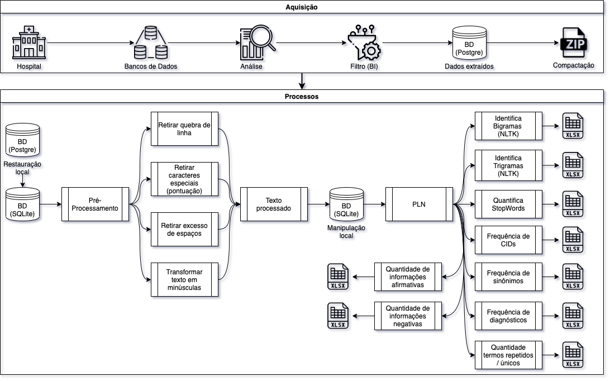

# RiLN (Recuperação da Informação em Linguagem Natural) # 

## Resumo: ##
O volume de informação produzido tanto na pesquisa médica quanto na prática clínica há muito exige tratamento computacional. Uma importante fonte de dados reais, relevante para a pesquisa, além de essencial para a gestão das unidades de saúde, é o prontuário de paciente. Dessa forma, técnicas de processamento de linguagem natural (PLN) são alternativas importantes para lidar com essa fonte dinâmica onde constantemente se registram novos dados. A presente pesquisa se insere nesse contexto, exibindo uma iniciativa de extração de dados de pacientes em um grande hospital através de técnicas de PLN. Para tanto, apresenta-se um background com informações sobre tais técnicas para então descrever os passos metodológicos, bem como os resultados parciais da extração realizado no campo médico da ginecologia.

### Palavras-chave: ###
Registros Eletrônicos de Saúde; 
Anamnese; 
Terminologia; 
Processamento de Linguagem Natural.

